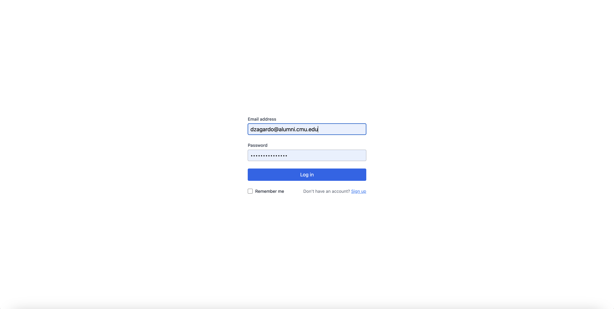
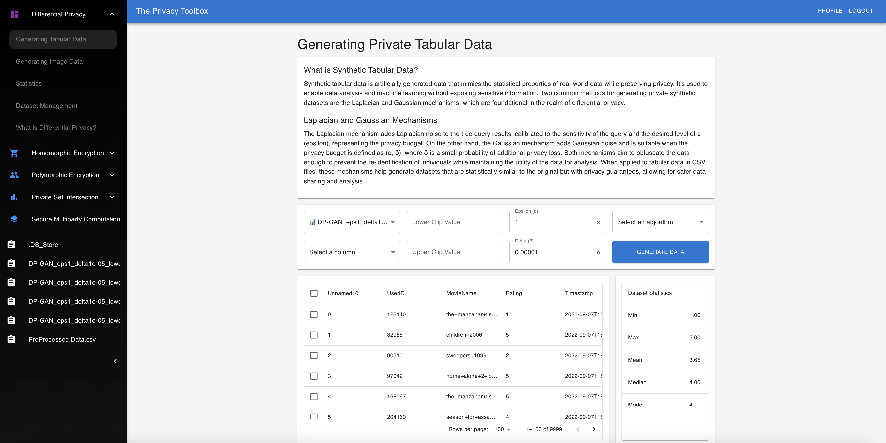
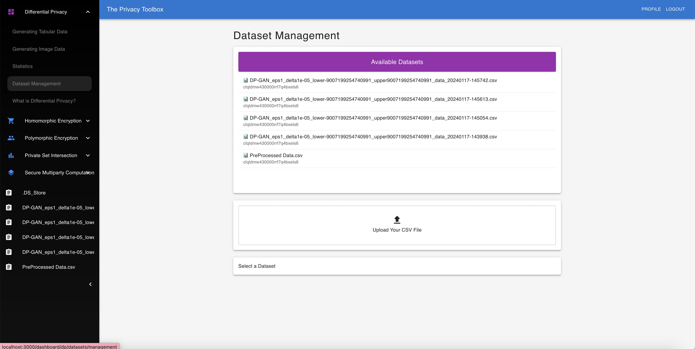

# Differential Privacy Deployment

This project aims to provide an interface for uploading CSV files and generating private synthetic data using a React-based frontend and Flask-based backend.

TODO:

Need to figure out why the dashboard/dp/statistics/${datasetId} route's buttons don't update the dataset state in the prisma backend.
Finish updating README
Figure out why we're dropping information in our JSON return from generating synthetic data






## Project Structure

```bash
DP_DEPLOYMENT/
│
├── backend/
│ ├── app.py - The Flask backend server
│ ├── data_synthesizer.py - Script for generating synthetic data
│ ├── requirements.txt - List of Python dependencies
│ └── data/
│  ├── preprocessed_10000_entries.csv - Example CSV file
│  └── synthetic_data.csv - Generated synthetic data
│
└── frontend/
 └── (React frontend files)
```

## Backend

The Flask backend (`app.py`) provides the following endpoints:

- `/`: The home route that returns a welcome message.
- `/upload_csv`: Endpoint to upload a CSV file and read its contents.
- `/generate_data`: Endpoint that takes a CSV file, generates synthetic data matching the number of records, replaces the 'rating' column, and saves the modified data.

## Frontend

The React frontend allows users to:

- Upload CSV files.
- Trigger the backend to generate synthetic data.
- Download the modified CSV file with synthetic data.

## Getting Started

To run the backend server, navigate to the `backend` directory and run:

```bash
pip install -r requirements.txt
flask run
```

Testing something!

This will start the Flask server on http://127.0.0.1:5000.

To start the frontend, navigate to the frontend directory and run:

```bash
npx build remix
npm install
npm run dev
```

This will launch the React application, usually on http://localhost:3000.

# Usage
1. Use the React frontend to upload a CSV file.
2. The file will be processed by the backend to generate synthetic data.
3. Download the modified CSV with synthetic ratings from the backend.

## Requirements
To install the necessary Python packages, run:

``` bash
pip install -r requirements.txt
```
Ensure you have Node.js and npm installed to manage the frontend dependencies.

## Contributions
Contributions are welcome. Please open an issue or submit a pull request with any improvements.